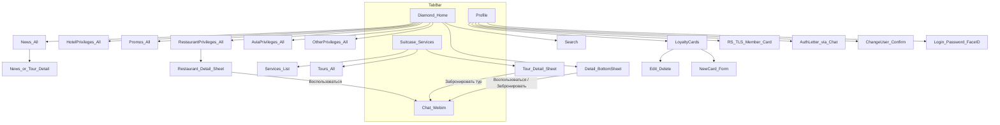

# Текущий макет МП «ТЛС Путешествия» (as-is)

Документация UI и информационной архитектуры по скриншотам приложения **RS TLS / ТЛС Путешествия**. Без редизайна — фиксация того, что уже есть в продукте.

**Источник:** 28 скринов в [`_screens/`](../_screens/) (папка «Скрины»).  
**Версия в TestFlight (справочно):** 1.48.  
**Статичный preview:** [`mockups/index.html`](../mockups/index.html) — открыть в браузере.  
**Варианты главной:** [`mockups/home-variants.html`](../mockups/home-variants.html) — **22** раскладки (V1–V22) для постановки iOS-задач.  
**Концепт карты:** [`mockups/map-nearby.html`](../mockups/map-nearby.html) — привилегии рядом на 2-й вкладке (Yandex MapKit).  
**Иконка приложения:** тёмно-синий квадрат, белый текст **RS TLS**, подпись на Springboard **«Путешествия»** (скрин `…42_10.387`, отмечена стрелкой).

---

## 1. Что это за приложение

Премиальный lifestyle / concierge-клиент:

| Область | Реализация (по продукту) |
|---------|--------------------------|
| Контент (новости, привилегии, туры, услуги) | CMS / Bitrix24 |
| Чат | Webim |
| Профиль / ЛК | Профиль клиента (Bitrix24), вход по телефону (заявлен, скрина нет) |

**Визуальный язык:** тёмная тема, крупные фото-карточки, акцент cyan/teal, полупрозрачные overlay на изображениях.

---

## 2. Глобальная навигация

### Tab Bar (4 вкладки)

| # | Иконка | Раздел | Назначение |
|---|--------|--------|------------|
| 1 | Бриллиант | Главная / Привилегии | Лента привилегий, новостей, акций |
| 2 | Чемодан | Услуги / Туры | Каталог услуг и туров |
| 3 | Чат | Чат | Webim |
| 4 | Профиль | Профиль | ЛК, карты лояльности |

Активная вкладка: cyan + точка под иконкой.

### Шапка лент (вкладки 1–2)

| Слева | Справа |
|-------|--------|
| Аватар / профиль | Поиск · Документы/папка · Звонок |

---

## 3. Карта навигации



---

### 4.0. Иконка приложения

| Поле | Значение |
|------|----------|
| Подпись на Springboard | **Путешествия** |
| Визуал | Тёмно-синий / почти чёрный rounded square |
| Контент иконки | Белый текст **RS TLS** (по центру) |
| Папка на устройстве | RSTLS (рядом «РС ТЛС Решения») |

**Скрин:** `…42_10.387.jpeg` (стрелка пользователя).  
**Ассет preview:** [`mockups/assets/app-icon.png`](../mockups/assets/app-icon.png).

---

## 4. Экраны

### 4.1. Главная (вкладка «Бриллиант»)

Вертикальный скролл из горизонтальных каруселей.

**Паттерн секции:** заголовок слева + ссылка **«Все»** (cyan) справа.

| # | Секция | Содержание карточек |
|---|--------|---------------------|
| 1 | Верхний баннер / featured | Отели, рестораны, офферы |
| 2 | Новости | Напр. «Премиум автомобили без границ», тур в Китай |
| 3 | Привилегии в отелях | Бассейны, Monte-Carlo, апгрейды номеров |
| 4 | Акции | Скидки с датами и локацией (Милан / Rocco Forte и т.д.) |
| 5 | Привилегии в ресторанах | Nebo Bistro и др. |
| 6 | Авиапривилегии | Emirates и др. |
| 7 | Другие привилегии | THE BANYA, скидки |

**Карточка:** фото + полупрозрачный overlay (название; опционально pin + город/страна; для акций — даты).

**Скрины:**  
`2026-07-21T13_21_28.667.jpeg` … `675.jpeg`, частично `672`–`674`.

### Варианты размещения (exploration)

Сравнение: [`mockups/home-variants.html`](../mockups/home-variants.html) — **22 варианта**. V1–V21 сохранены; V22 — hero + сетка (бывш. V27) с золотой обводкой `#c9a227`.

| Вариант | Компоновка |
|---------|------------|
| V1 | Заголовок offers → horizontal globe-carousel (peek) → «Сервисы» → stack баннеров |
| V2 | Как V1, категории — квадратная сетка 2×n |
| V3 | Как V1, категории — равномерная сетка 2 кол. |
| V4 | Как V1, категории — wide + pair |
| V5 | Как V1, категории — magazine |
| V6 | Панорамная сетка 2 кол. |
| V7 | Bento категорий |
| V8 | Шахматная / staggered сетка |
| V9–V13 | Мозаики: L / magazine / полосы / 3 кол. / cascade |
| V14 | Elite story-кружки → сетка категорий |
| V15–V16 | Высокий stories-rail (fullscreen / compact) |
| V17 | UISegmentedControl Lifestyle |
| V18 | Wide strip + bento |
| V19 | Offers в рамке + линия «Сервисы» + stack |
| V20 | Offers в рамке + категории в панели |
| V21 | Визитки · база (без фона стола, лёгкий угол) |
| V22 | Hero + сетка · обводка `#c9a227` |

### Идеи для второй страницы (без заказов / лояльности / рекомендаций)

Подходит под вкладку «Услуги» / деталку категории / профиль-контент:

| Экран | Что показать |
|-------|----------------|
| Лента привилегий / новостей | Редакционные карточки партнёров и акций (CMS), без «вам подойдёт» |
| Каталог внутри категории | Список заведений/услуг категории (фото, название, город) → деталка |
| Поиск | Глобальный поиск по категориям и партнёрам |
| Документы | Хранилище сканов (паспорт, виза, страховка) — папки, без статусов заказов |
| Concierge / чат | Темы обращения или быстрый вход в Webim |
| Гид по направлению | Editorial: город/страна, советы, партнёры (не персональные рекомендации) |
| Визы / ВНЖ info | Статьи и чек-листы оформления |
| Страхование / медицина | Каталог продуктов и клиник |
| Избранное | Только то, что пользователь сохранил сам |
| Уведомления | Сервисные push/inbox (статусы документов, ответы concierge) |
| Контакты RS TLS | Телефон, часы, эскалация |
| FAQ / как это работает | Онбординг сервиса |
| Профиль | Данные клиента, настройки, выход (без карт лояльности на этом экране) |

Сценарий полноэкранного просмотра stories проектируется отдельной задачей.

---

### 4.2. Список «Все» (Новости / Привилегии)

| Элемент | Описание |
|---------|----------|
| Навбар | Назад + заголовок (`Новости`, `Привилегии в ресторанах`, …) |
| Фильтры (рестораны) | Чипы: `Рестораны`, `Москва`, `Санкт-Петербург`, `Сочи` + иконка фильтров справа |
| Контент | Вертикальный список image-card |

**Скрины:**  
Новости — `670.jpeg`, `671.jpeg`.  
Рестораны — `006.jpeg`, `007.jpeg`, `009.jpeg`.

---

### 4.3. Деталка (bottom sheet)

Поверх full-bleed фото:

1. Закрытие `X`, drag handle  
2. Заголовок, локация (pin)  
3. Текст оффера / описание / маршрут  
4. CTA cyan:
   - привилегия / ресторан → **«Воспользоваться»**
   - тур → **«Забронировать тур»**
5. **После CTA** → переход в **Чат (Webim)** (подтверждено заказчиком; отдельный промежуточный экран не нужен)

**Примеры:**

- Ресторан: Nebo Bistro · Европейская кухня · Россия, Самара · скидка 10% от RS TLS  
- Тур: «Завтрак с жирафами» · Китай · Пекин — Хучжоу — Шанхай  

**Скрины:** `008.jpeg` (ресторан), `669.jpeg` (тур). Поток после CTA → см. чат `012.jpeg`.

---

### 4.4. Услуги (вкладка «Чемодан»)

**Лента вкладки:** карусели **Услуги** и **Туры** + «Все».

**Список «Услуги»** (карточки с подписью на фото):

1. Оформить визу  
2. Услуги для путешествий  
3. Оформление гражданства и ВНЖ  
4. Покупка недвижимости в России и по всему миру  
5. Покупка премиальных автомобилей по всему миру  

**Скрины:** `013.jpeg`, `014.jpeg`, `015.jpeg`, `667.jpeg`, `668.jpeg`.

---

### 4.5. Чат (Webim)

| Зона | Элементы |
|------|----------|
| Фон | Пейзаж (горы / ночное небо) |
| Шапка | `X` · заголовок «Чат» · галерея · звонок |
| Лента | Аватар + имя + пузырь + дата/время |
| Ввод | Скрепка · «Введите сообщение» · микрофон |

**Скрин:** `012.jpeg`.

---

### 4.6. Профиль

| Блок | Содержание |
|------|------------|
| Шапка | Иконка пользователя · «Профиль» · звонок |
| Идентичность | Аватар (edit) · ФИО · email · телефон |
| Привилегии | Карточка «RS TLS Member» (chevron) → **цифровая карта** |
| Карты лояльности | Строка с chevron → экран списка |
| Авторизационное письмо | Пусто: «Данные отсутствуют, для добавления напишите в чат» |
| Действие | Кнопка **«Сменить пользователя»** → диалог подтверждения |
| Доп. | Ссылка **«Удалить аккаунт»** (под кнопкой) |

**Скрины:** `011.jpeg`, `…42_10.392.jpeg` (диалог выхода).

#### 4.6.1. RS TLS Member — карта

По тапу на «RS TLS Member» открывается полноэкранная / модальная **цифровая карта**:

- Фон: фото побережья (тёмный песок / прибой)
- Слева сверху: **RS TLS**
- Справа снизу: номер участника, пример **`TLS00610970`**
- Внизу экрана — cyan-свечение (жест закрытия)

**Скрин:** `…42_10.393.jpeg`.

---

### 4.7. Карты лояльности

Модалка / экран с `X` и заголовком «Карты лояльности».

| Секция | `+` | Примеры записей |
|--------|-----|-----------------|
| Авиакомпании | да | S7 (Личная), Emirates, Turkish Airlines |
| Отели | да | Hilton |
| ЖД | да | РЖД (Личная), РЖД (Жена) |

Строка карты: логотип · название · номер · меню `…`.

Меню `…`: **Изменить** (карандаш) · **Удалить** (красный).

**Скрины:** `010.jpeg`, `…42_10.388.jpeg` (меню).

#### 4.7.1. Новая карта

Экран / sheet **«Новая карта»**:

- Тип карты (dropdown со списком авиакомпаний: Аэрофлот, S7, Flydubai, …)
- Поля: **Номер**, **Название**
- Кнопка **«Добавить»**

**Скрины:** `…42_10.389.jpeg`, `…42_10.390.jpeg`.

---

### 4.8. Вход / смена пользователя

Экран логина после «Сменить пользователя» / при входе:

- Заголовок **RS TLS** · подзаголовок Travel & Lifestyle Service
- Телефон текущего пользователя
- Поле **Пароль** · кнопка **Войти**
- Face ID
- **Восстановить пароль** · **Сменить пользователя**
- Фон: абстрактные тёмные квадраты

Диалог подтверждения выхода: номер телефона + «Вы действительно хотите выйти…?» · **Выйти** / **Отмена**.

**Скрины:** `…42_10.391.jpeg` (логин), `…42_10.392.jpeg` (диалог).

---

### 4.9. Поиск

Из шапки (лупа):

- Поле «Поиск» + **Отменить**
- Пустое состояние: «Введите более 3 символов»
- Результаты: те же image-card (пример запроса «Ресторан»)

**Скрины:** `…42_10.394.jpeg`, `…42_10.395.jpeg`.

---

## 5. Wireframe-схемы экранов (текстовые)

### Главная

```
┌─────────────────────────────┐
│ [аватар]     🔍  📁  📞     │
├─────────────────────────────┤
│ [==== featured carousel ===]│
│                             │
│ Новости              Все >  │
│ [card] [card] →             │
│                             │
│ Привилегии в отелях  Все >  │
│ [card] [card] →             │
│                             │
│ Акции                Все >  │
│ [card] [card] →             │
│ … секции привилегий …       │
├─────────────────────────────┤
│  ◆     🧳     💬     👤     │  ◆ = active
└─────────────────────────────┘
```

### Список / деталка

```
Список «Все»              Деталка (sheet)
┌──────────────────┐      ┌──────────────────┐
│ <  Заголовок  ⚙  │      │ X                │
│ [chip][chip]…    │      │████ full photo ██│
│ ┌──────────────┐ │      │┌────────────────┐│
│ │ image card   │ │      ││ Title · type   ││
│ └──────────────┘ │      ││ 📍 location    ││
│ ┌──────────────┐ │      ││ offer / text   ││
│ │ image card   │ │      ││ [ CTA button ] ││
│ └──────────────┘ │      │└────────────────┘│
│ ◆  🧳  💬  👤   │      └──────────────────┘
└──────────────────┘
```

### Профиль / карты / чат

```
Профиль                   Карты лояльности
┌──────────────────┐      ┌──────────────────┐
│    Профиль    📞 │      │ X  Карты лояльн. │
│      (avatar)    │      │ АВИАКОМПАНИИ  +  │
│     ФИО          │      │ [logo] S7  …     │
│  email / phone   │      │ ОТЕЛИ         +  │
│ Привилегии       │      │ [logo] Hilton …  │
│ [RS TLS Member>] │      │ ЖД            +  │
│ Карты лояльности>│      │ [logo] РЖД   …   │
│ Авториз. письмо  │      └──────────────────┘
│ [Сменить польз.] │
│ ◆  🧳  💬  👤   │
└──────────────────┘

Чат
┌──────────────────┐
│ X   Чат    🖼 📞 │
│ [сообщения…]     │
│ 📎 [ввод…]    🎤 │
└──────────────────┘
```

---

## 6. UI-система (as-is)

Цвета сняты со скринов (пиксельный sample):

| Токен | Значение |
|-------|----------|
| Фон | `#000000` |
| Акцент / CTA | `#0098BD` … `#1396B6` |
| Активный таб / «Все» | `#00B7D4` |
| Неактивные иконки Tab Bar | `#B0B0B0` |
| Круги в шапке | `#2A2A2D`, глифы `#A0A0A5` |
| Аватар-плейсхолдер | `#E4EAF3` |
| Tab bar (glass) | `rgba(27, 42, 45, 0.88)` |
| Текст secondary | `#8E8E93` |
| Карточки | Radius ≈ 16–24 pt |
| Overlay на фото | Тёмный полупрозрачный pill |
| Шрифт | Системный San Francisco |

Статичный preview с этими токенами и SVG-иконками по формам со скринов: [`mockups/index.html`](../mockups/index.html).

---

## 7. Привязка скринов к экранам

| Файл | Экран |
|------|--------|
| `…11.006`–`007`, `009` | Привилегии в ресторанах (список) |
| `…11.008` | Деталка ресторана → CTA → **чат** |
| `…11.010` | Карты лояльности |
| `…11.011` | Профиль |
| `…11.012` | Чат (Webim) |
| `…11.013`–`015` | Услуги (список) |
| `…28.667`–`668` | Услуги / Туры (лента) |
| `…28.669` | Деталка тура → CTA → **чат** |
| `…28.670`–`671` | Новости (список) |
| `…28.672`–`675` | Главная |
| `…42_10.387` | **Иконка приложения** (стрелка) |
| `…42_10.388` | Карты лояльности · меню Изменить/Удалить |
| `…42_10.389`–`390` | Новая карта (+ dropdown авиа) |
| `…42_10.391` | Логин (пароль / Face ID) |
| `…42_10.392` | Диалог «Сменить пользователя» + «Удалить аккаунт» |
| `…42_10.393` | **RS TLS Member** — карта с номером `TLS00610970` |
| `…42_10.394`–`395` | Поиск (пусто / результаты) |

Путь: [`_screens/`](../_screens/).

---

## 8. Пробелы (ещё не заснáто)

| Экран / поток | Статус |
|---------------|--------|
| Документы / папка (иконка в шапке) | Не заснят |
| Расширенные фильтры ресторанов (слайдеры) | Не заснят экран фильтров |
| Списки «Все» для отелей / акций / авиа / других | Не засняты отдельно |
| Онбординг / ввод телефона с нуля (SMS) | Есть логин по паролю; SMS-флоу не заснят |
| Содержимое чата сразу после «Воспользоваться» (префилл заявки) | Поток подтверждён (→ чат); префилл сообщения не виден на скрине |

---

## 9. Вне скоупа этого документа

- Редизайн и новая визуальная концепция  
- Код iOS / исходники  
- Спецификация API Bitrix24 / Webim  

Следующий шаг после фиксации as-is: список доработок и целевой макет (to-be).
